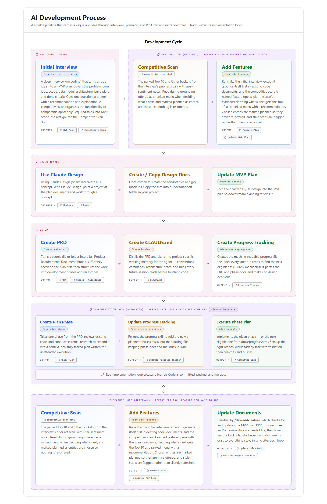

# `Development/` — the AI development process

A pipeline of skills that carries a vague app idea through interviews, planning,
and a PRD into an unattended plan → track → execute implementation loop. Planning
happens through relentless interviews, requirements land in machine-readable HTML
documents, and implementation runs one validated task at a time behind
machine-checkable gates.

<picture>
  <source media="(prefers-color-scheme: dark)" srcset="../assets/pipeline-dark.jpg">
  
</picture>

## The pipeline

1. **[`dev-initial-interview`](dev-initial-interview/SKILL.md)** — a
   branch-by-branch requirements interview that turns a vague app idea into an
   agreed MVP plan. No code, ever. Includes a competitive scan of comparable
   apps, inventoried into Required, Top 10, and Other — only Required folds into
   MVP scope; the rest becomes a durable backlog.
   *Outputs: MVP plan + `docs/competitive-scan.html`.*

2. **[`dev-add-feature`](dev-add-feature/SKILL.md)** — the same kind
   of interview for something that already exists. Grounds itself in the current
   plan, the repo, and the competitive scan before asking anything, then offers
   the Top 10 as a ranked menu with a recommendation. Chosen entries are marked
   planned so they aren't re-offered. Repeat per feature.
   *Outputs: feature plan + updated MVP plan.*

3. **[`dev-ui-update`](dev-ui-update/SKILL.md)** — folds a visual
   design handoff (HTML mockups, design tokens, screenshots, a handoff README)
   into the planning docs. Authors or amends `docs/design-system.html` as the
   single source of truth for everything design, surfaces every conflict with
   the existing plan for you to decide, then sweeps stale design lines out of
   the MVP plan, PRD, progress tracker, feature briefs, and competitive scan.
   Keeps a dated handoff log so a locked decision is superseded, never silently
   overwritten. Writes no application code. Run it whenever a design lands —
   the first handoff and every later revision.
   *Outputs: `docs/design-system.html` + reconciled plan docs.*

4. **[`dev-create-prd`](dev-create-prd/SKILL.md)** — turns the plans
   into a standalone HTML PRD with development phases and milestones. Runs a
   sufficiency check on the source material first. The output follows a strict
   HTML contract that the downstream skills parse.
   *Output: `docs/prd.html`.*

5. **[`dev-claud-md`](dev-claud-md/SKILL.md)** — distills the PRD and
   the repo into the project's `CLAUDE.md`, so every downstream agent run
   inherits the same conventions, commands, and architecture notes.
   Stack-adaptive, with a .NET/C# profile by default.
   *Output: `CLAUDE.md` at the repo root.*

6. **[`dev-create-progress`](dev-create-progress/SKILL.md)** —
   mechanically aggregates the phase docs and the PRD into
   `docs/progress.html`, the machine-readable index every later run reads to find
   the next eligible task. Purely mechanical; makes no design decisions. Re-run
   whenever a phase doc changes.
   *Output: `docs/progress.html`.*

7. **[`dev-plan-phase`](dev-plan-phase/SKILL.md)** — expands one PRD
   phase into a context-rich, fully tasked phase doc via codebase analysis and
   external research. This skill is the slug and task authority: it picks the
   phase slug, branch name, and canonical task list, and writes no implementation
   code itself.
   *Output: `docs/phases/phase-<N>-<slug>.html`.*

8. **[`dev-execute`](dev-execute/SKILL.md)** — implements a phase one
   validated task at a time, then finishes end-to-end: branch, commits, PR
   opened, squash-merged, default branch synced and re-verified green. Resolves
   the next eligible phase from `docs/progress.html` on its own.
   *Output: a merged phase + updated progress tracking.*

9. **[`dev-orchestrate`](dev-orchestrate/SKILL.md)** — runs the whole
   implementation loop autonomously. Preflights the repo and toolchain, then for
   each incomplete phase launches a planning sub-agent and an execution
   sub-agent, re-checking machine-verifiable gates itself between every step and
   stopping hard on any failure. Never implements anything directly. Takes an
   optional bound (`2`, `through 4`).
   *Output: completed phases, one merged PR each, plus a final report.*

Steps 6–8 form the implementation loop, repeated until every phase is complete —
either by hand or run end-to-end by step 9. The feature loop (step 2) and the
design loop (step 3) can also be re-entered against a working app, folding new
features and new designs back into the plan docs.

## Core principles

- **No code before the plan.** The interview, design, and planning skills never
  write application code — schemas, API shapes, and data models are fine when
  they *are* the design decision.
- **Recommendations, not option lists.** Questions come one at a time, each with
  a recommended answer and a one-line reason, so you can reply "yes" and move on.
- **HTML contracts.** The PRD, phase docs, and progress tracker are standalone
  HTML with exact, parseable shapes (`data-phase`, `data-task`, `data-status`).
  Downstream skills parse structure, not prose.
- **Unattended execution.** Phase docs contain zero "ask the user" steps; every
  task ends with a non-interactive validation command.
- **Gates, not trust.** Machine-verifiable gates are re-checked between steps —
  phase doc shape, merged PR, clean tree, green build — with a hard stop on
  failure rather than building on an unverified foundation.
- **One source of truth per artifact.** Phase docs own slugs, branch names, and
  task lists; the PRD owns the set of phases; `docs/design-system.html` owns
  design; `docs/progress.html` is a derived index, never hand-authored.

## Everything in the infographic is published

The "Update Documents" step in the infographic isn't a separate skill — it's
handled by `dev-add-feature`, which folds a shipped feature back into the MVP
plan, PRD, progress file, and competitive scan.
