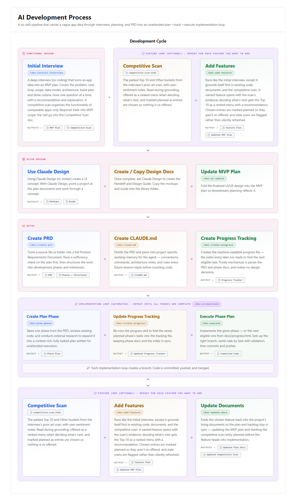

# Skills

A list of the AI skills I have been developing and using.

Each skill is a folder containing a `SKILL.md` (plus any templates or specs it
needs). Drop a folder into your agent's skills directory to use it.

## Skills

### [`brainstorm`](brainstorm/SKILL.md)

Runs an idea-generation session: exploring possibilities, generating options,
and pressure-testing half-formed plans. Gives ideas in batches of five to eight
distinct options with a stated recommendation, but asks only one question per
turn. Researches the web when outside input would sharpen the ideas. Strictly
read-only — it will not create, edit, or delete any file until you explicitly
say to. Companion to `conversation`, which governs how the questions get asked.

### [`conversation`](conversation/SKILL.md)

Governs how the agent asks for information in any back-and-forth — scoping,
requirements gathering, troubleshooting, planning. Three rules: no multiple
choice or option-picker widgets, one question per turn, and every question
arrives with a recommendation and the reasoning behind it. Applies whenever a
reply would otherwise contain a clarifying question.

### [`git-main`](git-main/SKILL.md)

Safely returns to the repo's default branch and pulls the latest changes.
Auto-detects `main` vs `master` from the `origin` remote rather than assuming,
warns and lists files first if there are uncommitted changes, and reports the
resulting branch, commit, and how many commits came in.

### [`infographic-html`](infographic-html/SKILL.md)

Creates polished, self-contained HTML infographics in a dark technical design
system — for visualizing processes, workflows, methodologies, or phased
reference content. Defines the full design system: Syne + JetBrains Mono, a CSS
variable palette, and component patterns for pills, step circles, callout boxes,
and convergence footers. Includes a layout decision guide and a pre-delivery
quality checklist. Output is always a single `.html` file with embedded CSS.

### [`okf-html-library`](okf-html-library/SKILL.md)

Maintains a personal, browsable knowledge library in the Open Knowledge Format
(HTML profile), where each concept is a themed HTML file you read in a browser.
Handles adding and updating concepts, regenerating indexes, and organizing
around topic hubs — main topics get a hub page and a folder, and the root index
stays a clean map rather than a pile. Styling lives only in a shared
`theme.css`; all links are relative so the library works over `file://`.
Ships with `SPEC.md` and `templates/` (concept, index, theme).

## `Development/` — the AI development process

A pipeline of skills that carries a vague app idea through interviews, planning,
and a PRD into an unattended plan → track → execute implementation loop. Planning
happens through relentless interviews, requirements land in machine-readable HTML
documents, and implementation runs one validated task at a time behind
machine-checkable gates.

<picture>
  <source media="(prefers-color-scheme: dark)" srcset="assets/pipeline-dark.png">
  
</picture>

### The pipeline

1. **[`dev-initial-interview`](Development/dev-initial-interview/SKILL.md)** — a
   branch-by-branch requirements interview that turns a vague app idea into an
   agreed MVP plan. No code, ever. Includes a competitive scan of comparable
   apps, inventoried into Required, Top 10, and Other — only Required folds into
   MVP scope; the rest becomes a durable backlog.
   *Outputs: MVP plan + `docs/competitive-scan.html`.*

2. **[`dev-add-feature`](Development/dev-add-feature/SKILL.md)** — the same kind
   of interview for something that already exists. Grounds itself in the current
   plan, the repo, and the competitive scan before asking anything, then offers
   the Top 10 as a ranked menu with a recommendation. Chosen entries are marked
   planned so they aren't re-offered. Repeat per feature.
   *Outputs: feature plan + updated MVP plan.*

3. **[`dev-create-prd`](Development/dev-create-prd/SKILL.md)** — turns the plans
   into a standalone HTML PRD with development phases and milestones. Runs a
   sufficiency check on the source material first. The output follows a strict
   HTML contract that the downstream skills parse.
   *Output: `docs/prd.html`.*

4. **[`dev-claud-md`](Development/dev-claud-md/SKILL.md)** — distills the PRD and
   the repo into the project's `CLAUDE.md`, so every downstream agent run
   inherits the same conventions, commands, and architecture notes.
   Stack-adaptive, with a .NET/C# profile by default.
   *Output: `CLAUDE.md` at the repo root.*

5. **[`dev-create-progress`](Development/dev-create-progress/SKILL.md)** —
   mechanically aggregates the phase docs and the PRD into
   `docs/progress.html`, the machine-readable index every later run reads to find
   the next eligible task. Purely mechanical; makes no design decisions. Re-run
   whenever a phase doc changes.
   *Output: `docs/progress.html`.*

6. **[`dev-plan-phase`](Development/dev-plan-phase/SKILL.md)** — expands one PRD
   phase into a context-rich, fully tasked phase doc via codebase analysis and
   external research. This skill is the slug and task authority: it picks the
   phase slug, branch name, and canonical task list, and writes no implementation
   code itself.
   *Output: `docs/phases/phase-<N>-<slug>.html`.*

7. **[`dev-execute`](Development/dev-execute/SKILL.md)** — implements a phase one
   validated task at a time, then finishes end-to-end: branch, commits, PR
   opened, squash-merged, default branch synced and re-verified green. Resolves
   the next eligible phase from `docs/progress.html` on its own.
   *Output: a merged phase + updated progress tracking.*

Steps 5–7 form the implementation loop, repeated until every phase is complete.
The feature loop (step 2) can also be re-entered against a working app, folding
new features back into the plan docs.

### Core principles

- **No code before the plan.** The interview and planning skills never write
  application code — schemas, API shapes, and data models are fine when they
  *are* the design decision.
- **Recommendations, not option lists.** Questions come one at a time, each with
  a recommended answer and a one-line reason, so you can reply "yes" and move on.
- **HTML contracts.** The PRD, phase docs, and progress tracker are standalone
  HTML with exact, parseable shapes (`data-phase`, `data-task`, `data-status`).
  Downstream skills parse structure, not prose.
- **Unattended execution.** Phase docs contain zero "ask the user" steps; every
  task ends with a non-interactive validation command.
- **Gates, not trust.** Machine-verifiable gates are re-checked between steps —
  phase doc shape, merged PR, clean tree, green build — with a hard stop on
  failure rather than building on an unverified foundation.
- **One source of truth per artifact.** Phase docs own slugs, branch names, and
  task lists; the PRD owns the set of phases; `docs/progress.html` is a derived
  index, never hand-authored.

### Not in this repo yet

The infographic shows three skills that aren't published here: `/dev-ui-update`
(fold a finalized UI/UX design into the MVP plan), `/dev-orchestrate` (run the
whole implementation loop autonomously behind gates), and `/dev-update-docs`
(fold a shipped feature back into the living plan docs).
